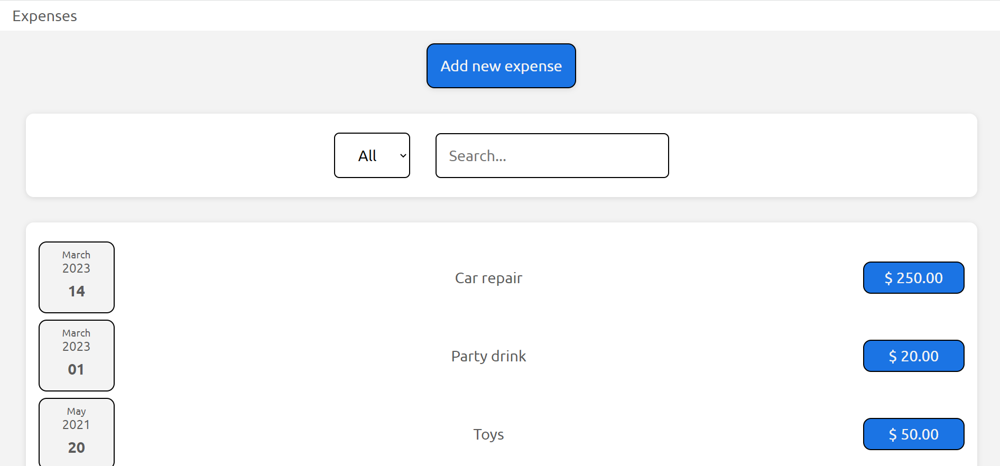
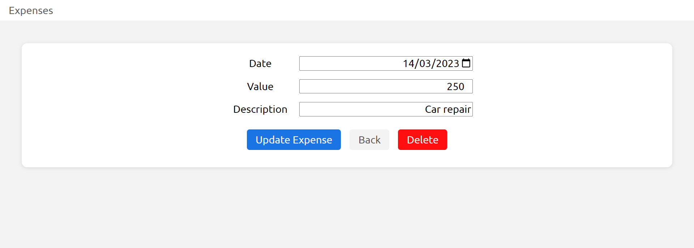
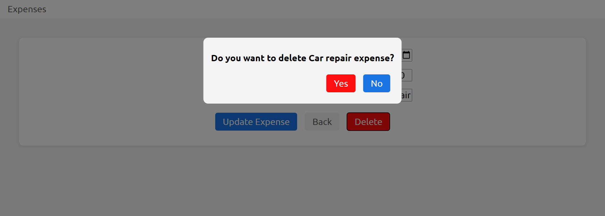

# Personal Expenses

This project allows users to monitor their expenses by providing a financial controller that enables them to view and add new transactions.

## Table of contents

- [Overview](#overview)
  - [The challenge](#the-challenge)
  - [Screenshot](#screenshot)
  - [Links](#links)
- [My process](#my-process)
  - [Built with](#built-with)
  - [What I learned](#what-i-learned)
  - [Useful resources](#useful-resources)
- [Author](#author)

## Overview

### The challenge

Users should be able to:

- See the expenses list
- Add new expense
- See warning for invalid inputs
- See hover and focus states for all interactive elements on the page
- Use the software on any device sizes

### Screenshot







### Links

- Live Site URL: [Add live site URL here](https://personal-expenses-sand.vercel.app/)

## My process

### Built with

- Semantic HTML5 markup
- CSS custom properties
- Mobile-first workflow
- React
- TypeScript
- Styled Components
- Vite
- Firebase - BaaS

### What I learned

React hook to fetch data from firebase:

```ts
const [isLoading, setIsLoading] = useState(false);
const [error, setError] = useState(null);

const sendRequest = useCallback(
  async (requestConfig: Config, loadData: (data: any) => void) => {
    setIsLoading(true);
    setError(null);

    try {
      const response = await fetch(URL, {
        method: requestConfig.method ? requestConfig.method : 'GET',
        headers: requestConfig.headers ? requestConfig.headers : {},
        body: requestConfig.body ? JSON.stringify(requestConfig.body) : null,
      });

      if (!response.ok) {
        throw new Error('Request failed.');
      }

      const data = await response.json();
      loadData(data);
    } catch (error: unknown) {
      console.log(error);
    }

    setIsLoading(false);
  },
  []
);

return { isLoading, error, sendRequest };
```

React router routes:

```ts
const router = createBrowserRouter([
  {
    path: '/',
    element: <Root />,
    children: [
      { path: '/', element: <Welcome /> },
      {
        path: '/expenses',
        element: <ExpensesIndex />,
      },
      { path: '/expenses/new-expense', element: <NewExpense /> },
    ],
  },
]);
```

Custom component in Styled Components:

```ts
const NewExpense = styled(Link)`
  border-radius: 12px;
  padding: 0.5rem;
  cursor: pointer;
  text-decoration: none;
  color: black;

  &:hover,
  :active {
    text-decoration: underline;
    color: ${theme.colors.e};
  }
`;
```

### Useful resources

- [CSS Variables for React Devs](https://www.joshwcomeau.com/css/css-variables-for-react-devs/) - This helped to set up global style variables in styled components.
- [Box-shadow examples](https://getcssscan.com/css-box-shadow-examples) - This is a page with multiple examples of box-shadow usage.

## Author

- LinkedIn - [Winstein Martins](https://www.linkedin.com/in/winstein-martins/)
